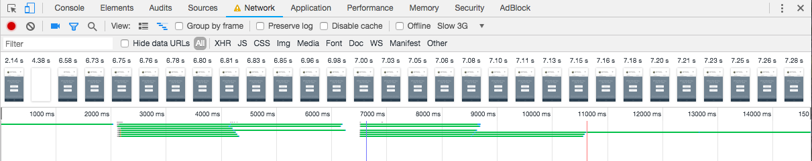

# Load time analysis of libraries used in our project
Cphbusiness - UFO course - Assignment 2 - Exercise 2

I ran a load time performance analysis on a web project I built for my work. Note that since it is a private repository I could not include the link here, but I'm happy to show the source code if needed. The analysis was done on the production version of the website available at [agents.valuer.ai](http://agents.valuer.ai) - only supports mobile devices. In the production version the code is bundled, minified and optimized for fast loading performance.

## Problem 

When serving content to the user it is important that the libraries used do not slow down extensively the loading time of the website. In order to make the user engage with our website as soon as possible Google recommends that we use a "budget" when loading our resources for the website:

> PageSpeed Insights analyzes a page to see if it follows our recommendations for making a page render in under a second on a mobile network. Research has shown that any delay longer than a second will cause the user to interrupt their flow of thought, creating a poor experience. Our goal is to keep the user engaged with the page and deliver the optimal experience, regardless of device or type of network.

## Investigation

We can use the built in Network panel in the Chrome Inspector to analyize the loading time of our website. The resources that took the most time were external libraries. `Axios` is used to make client side HTTP requests while `Semantic` is a CSS library.

The `Semantic UI` CSS library takes around 531 ms to download on fast network connection.

`Axios` takes 406 ms to download, after which it still needs processing.

None of these libraries slow down the loading performance considerably on PC with a fast connection, however it is important to test a slower 3G connection as well, which we can simulate in the debugger. The picture below shows that the loading performance is considerable worse on a poor mobile connection, taking over 15.000 ms to load all the resources. Even though we have some content to display already at 2.14 seconds, the time to interact with the website is taking longer than ideal.

## Solution

Looking at the loading times on mobile devices which are the primary targets of the web application, we should consider improving the performance in order to engage the users earlier and not waste precious seconds.

Google has a few tips and recommends server side rendering, inlining the JavaScript code to avoid extra roundtrips, loading certain libraries after the content is rendered. In case of CSS libraries we could remove libraries which are not used, or reduce the modules loaded to the absolutely neccessary ones. Let's say we only use the button styles of a certain library, in which case - if possible - we should not load all of the other modules styling tabs, inputs etc.

Another solution can be to use fast CDNs (Content Delivery Network) whose servers are located close to our target users. We could also include the vendor files in our own project and serve them from our servers if those are more optimized to delivering files fast and close to the user.